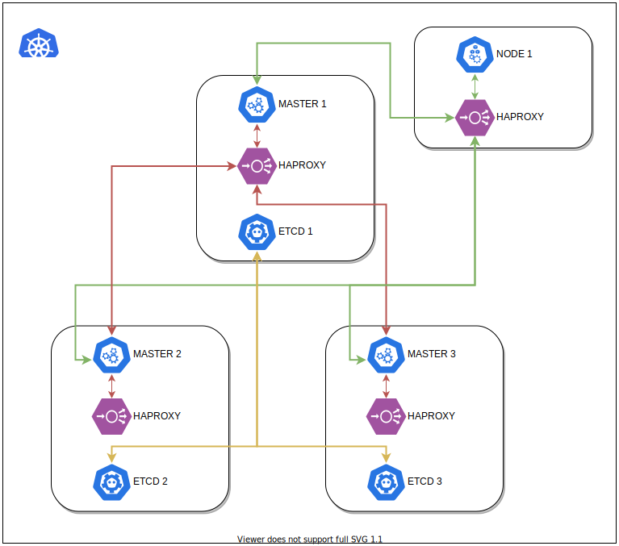
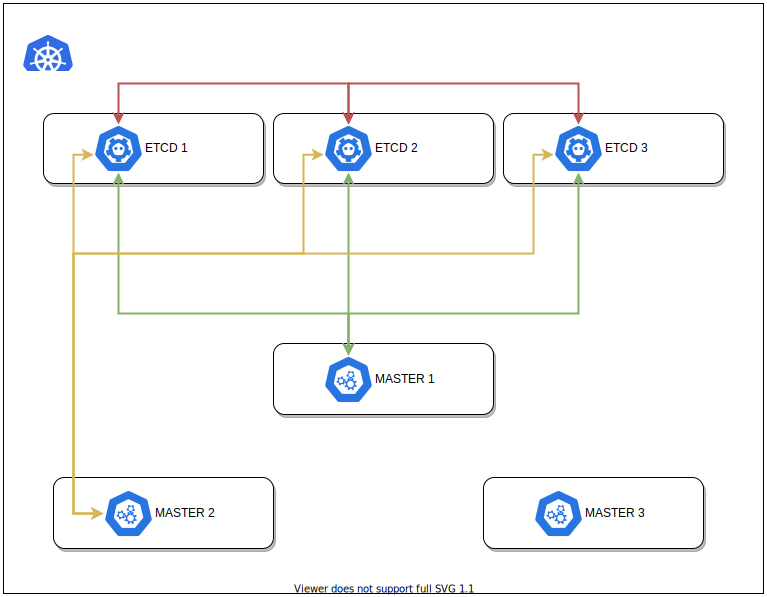

# Epiphany Kubernetes HA design document

Affected version: 0.5.x

## 1. Goals

Provide highly-available control-plane version of Kubernetes.

## 2. Cluster components

### 2.1 Load balancer

#### 2.1.1 External

Kubernetes HA cluster needs single TCP load-balancer to communicate from nodes to masters and from masters to masters (all internal communication has to go through the load-balancer).


__PROS__:
- standard solution

__CONS__:
- it's not enough just to create one instance of such load-balancer, it needs failover logic (like virtual IP), so in the end for fully highly-available setup we need automation for whole new service
- requires additional dedicated virtual machines (at least 2 for HA) even in the case of single-master cluster
- probably requires infrastructure that can handle virtual IP (depending on the solution for failover)

#### 2.1.2 Internal

Following the idea from [kubespray's HA-mode](https://github.com/kubernetes-sigs/kubespray/blob/master/docs/ha-mode.md)
we can skip creation of dedicated external load-balancer ([2.1.1](#211-external)).

Instead, we can create identical instances of lightweight load-balancer (like HAProxy) on each master and each kubelet node.



__PROS__:
- no need for creation of dedicated load-balancer clusters with failover logic
- since we could say that internal load-balancer is replicated, it seems to be highly-available by definition

__CONS__:
- increased network traffic
- longer provisioning times as (in case of any changes in load-balancer's configs) provisioning needs to touch every node in the cluster (master and kubelet node)
- debugging load-balancer issues may become slightly harder

### 2.2 Etcd cluster

#### 2.2.1 External



__PROS__:
- in the case of high network / system load external etcd cluster deployed on dedicated premium quality virtual machines will behave more stable

__CONS__:
- requires automation for creation and distribution of etcd's server and client PKI certificates
- upgrading etcd is difficult and requires well-tested autmation that works on multiple nodes at once in perfect coordination - in the case when etcd's quorum fails,
  it is unable to auto-heal itself and it requires to be reconstructed from scratch (where data loss or discrepancy seems to be likely)

#### 2.2.2 Internal


__PROS__:
- adding / removing etcd nodes is completely automated and behaves as expected (via kubeadm)
- etcd's PKI is automatically re-distributed during joining new masters to control-plane

__CONS__:
- etcd is deployed in containers alongside other internal components, which may impact its stability when system / network load is high
- since etcd is containerized it may be prone to docker-related issues

## 3. Legacy single-master solution

After HA logic is implemented, it is probably better to reuse new codebase also for single-master clusters.

In the case of using internal load-balancer ([2.1.2](#212-internal)) it makes sense to use scaled-down (to single node) HA cluster (with single-backended load-balancer) and drop legacy code.

## 4. Use cases

The Epiphany Platform delivers highly-available Kubernetes clusters deploying them across multiple availability zones / regions to increase stability of production environments.

## 5. Example use

```yaml
kind: epiphany-cluster
title: "Epiphany cluster Config"
provider: any
name: "k8s1"
specification:
  name: k8s1
  admin_user:
    name: ubuntu
    key_path: /workspaces/epiphany/core/src/epicli/clusters/id_ed25519
  components:
    kubernetes_master:
      count: 3
      machines:
        - default-k8s-master1
        - default-k8s-master2
        - default-k8s-master3
    kubernetes_node:
      count: 2
      machines:
        - default-k8s-node1
        - default-k8s-node2
    logging:
      count: 0
    monitoring:
      count: 0
    kafka:
      count: 0
    postgresql:
      count: 0
    load_balancer:
      count: 0
    rabbitmq:
      count: 0
---
kind: infrastructure/machine
provider: any
name: default-k8s-master1
specification:
  hostname: k1m1
  ip: 10.10.1.148
---
kind: infrastructure/machine
provider: any
name: default-k8s-master2
specification:
  hostname: k1m2
  ip: 10.10.2.129
---
kind: infrastructure/machine
provider: any
name: default-k8s-master3
specification:
  hostname: k1m3
  ip: 10.10.3.16
---
kind: infrastructure/machine
provider: any
name: default-k8s-node1
specification:
  hostname: k1c1
  ip: 10.10.1.208
---
kind: infrastructure/machine
provider: any
name: default-k8s-node2
specification:
  hostname: k1c2
  ip: 10.10.2.168
```

## 6. Design proposal

As for the design proposal, the simplest solution is to take internal load-balancer ([2.1.2](#212-internal)) and internal etcd ([2.2.2](#222-internal)) and merge them together,
then carefully observe and tune network traffic comming from haproxy instances for big number of worker nodes.


Example HAProxy config:
```
global
    log /dev/log local0
    log /dev/log local1 notice
    daemon

defaults
    log global
    retries 3
    maxconn 2000
    timeout connect 5s
    timeout client 120s
    timeout server 120s

frontend k8s
    mode tcp
    bind 0.0.0.0:3446
    default_backend k8s

backend k8s
    mode tcp
    balance roundrobin
    option tcp-check

    server k1m1 10.10.1.148:6443 check port 6443
    server k1m2 10.10.2.129:6443 check port 6443
    server k1m3 10.10.3.16:6443 check port 6443
```

Example ClusterConfiguration:
```yaml
apiVersion: kubeadm.k8s.io/v1beta1
kind: ClusterConfiguration
kubernetesVersion: v1.14.6
controlPlaneEndpoint: "localhost:3446"
apiServer:
  extraArgs: # https://kubernetes.io/docs/reference/command-line-tools-reference/kube-apiserver/
    audit-log-maxbackup: "10"
    audit-log-maxsize: "200"
    audit-log-path: "/var/log/apiserver/audit.log"
    enable-admission-plugins: "AlwaysPullImages,DenyEscalatingExec,NamespaceLifecycle,ServiceAccount,NodeRestriction"
    profiling: "False"
controllerManager:
  extraArgs: # https://kubernetes.io/docs/reference/command-line-tools-reference/kube-controller-manager/
    profiling: "False"
    terminated-pod-gc-threshold: "200"
scheduler:
  extraArgs: # https://kubernetes.io/docs/reference/command-line-tools-reference/kube-scheduler/
    profiling: "False"
networking:
  dnsDomain: cluster.local
  podSubnet: 10.244.0.0/16
  serviceSubnet: 10.96.0.0/12
certificatesDir: /etc/kubernetes/pki
```

To deploy first master run ([Kubernetes 1.14](https://v1-14.docs.kubernetes.io/docs/setup/production-environment/tools/kubeadm/high-availability/#stacked-control-plane-and-etcd-nodes)):
```bash
$ sudo kubeadm init --config /etc/kubernetes/kubeadm-config.yml --experimental-upload-certs
```

To add one more master run ([Kubernetes 1.14](https://v1-14.docs.kubernetes.io/docs/setup/production-environment/tools/kubeadm/high-availability/#stacked-control-plane-and-etcd-nodes)):
```bash
$ sudo kubeadm join localhost:3446 \
         --token 932b4p.n6teb53a6pd1rinq \
         --discovery-token-ca-cert-hash sha256:bafb8972fe97c2ef84c6ac3efd86fdfd76207cab9439f2adbc4b53cd9b8860e6 \
         --experimental-control-plane --certificate-key f1d2de1e5316233c078198a610c117c65e4e45726150d63e68ff15915ea8574a
```

To remove one master run (it will properly cleanup config inside Kubernetes - do not use `kubectl delete node`):
```
$ sudo kubeadm reset --force
```

In later versions ([Kubernetes 1.17](https://kubernetes.io/docs/setup/production-environment/tools/kubeadm/high-availability/#stacked-control-plane-and-etcd-nodes)) this feature became stable and "experimental" word in the commandline paremeters was removed.
