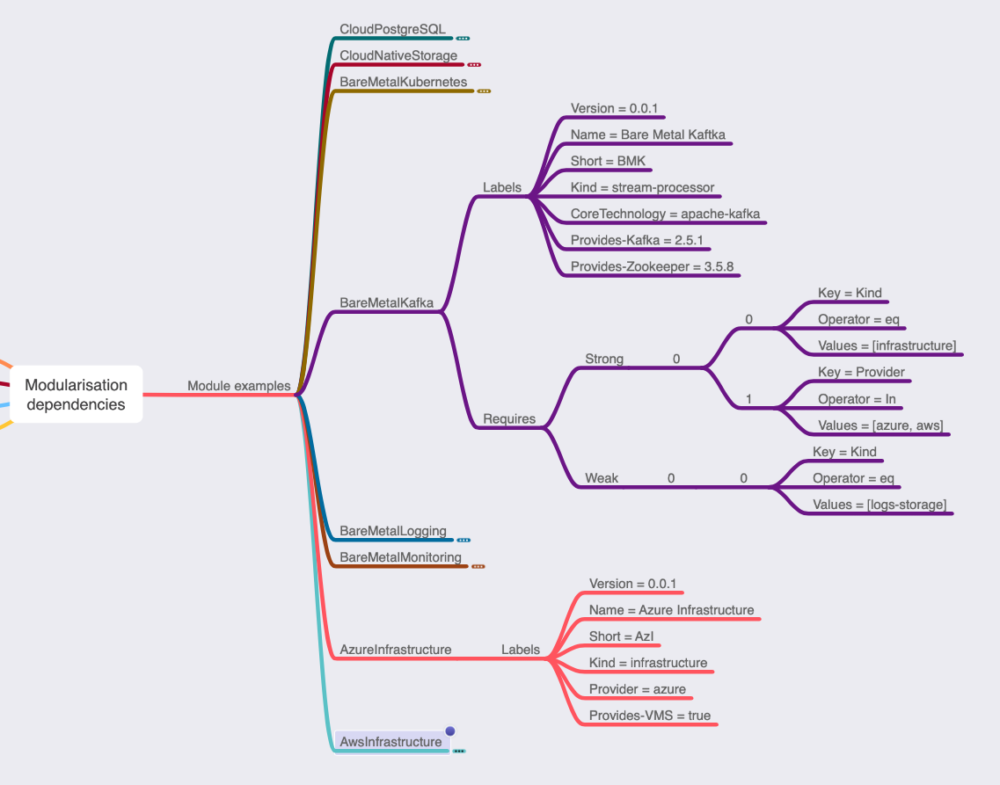

# Context

This design document presents findings on what are important pieces of modules communication it Dockerized Custom Modules approach described [here](./modularization-approaches.md). 

# Plan 

Idea is to have something running and working mimicking real world modules. I used GNU make to perform this. With GNU make I was able to easily implement “run” logic. I also wanted to package everything into docker images to experience real world containers limitations of communication, work directory sharing and other stuff. 

# Dependencies problem

First definition of modules [here](https://github.com/mkyc/epiphany-wrapper-poc-repo/blob/master/v1.yaml) in example presented here: 

```
version: v1
kind: Repository
components:
- name: c1
  type: docker
  versions:
  - version: 0.1.0
    latest: true
    image: "docker.io/hashicorp/terraform:0.12.28"
    workdir: "/terraform"
    mounts: 
    - "/terraform"
    commands:
    - name: init
      description: "initializes terraform in local directory"
      command: init
      envs:
        TF_LOG: WARN
    - name: apply
      description: "applies terraform in local directory"
      command: apply
      envs:
        TF_LOG: DEBUG
      args:
      - -auto-approve
```

... didn't have any dependencies section. We know that some kind of dependencies will be required very soon. I created idea of how to define dependencies between modules in following mind map: 



It shows following things: 
 * every module has some set of labels. I don't think we need to have any "obligatory" labels. If you create very custom ones you will be very hard to find. 
 * module has `requires` section with possible subsections `strong` and `weak`. A strong requirement is one has to be fulfilled for the module to be applied. A weak requirement, on the other hand, is something we can proceed without, but it is in some way connected when present. 
 
It's worth co notice each `requires` rule. I used [kubernetes matchExpressions](https://kubernetes.io/docs/concepts/overview/working-with-objects/labels/#resources-that-support-set-based-requirements) approach as main way of defining dependencies, as one of main usage here would be "version >= X", and we cannot use simple labels matching mechanism without being forced to update all modules using my module every time I release a new version of that module.   
 
# Influences

I started to implement example docker based mocked modules in [tests](./cpt-tests) directory, and I found a 3rd section required: `influences`. To explain this lets notice one folded module in upper picture: "BareMetalMonitoring". It is Prometheus based module so, as it works in pull mode, it needs to know about addresses of machines it should monitor. Let's imagine following scenario:
 * I have Prometheus already installed, and it knows about IP1, IP2 and IP3 machines to be monitored,  
 * in next step I install, let's say `BareMetalKafka` module, 
 * so now, I want Prometheus to monitor Kafka machines as well,  
 * so, I need `BareMetalKafka` module to "inform" in some way `BareMetalMonitoring` module to monitor IP4, IP5 and IP6 addresses to addition of what it monitors already. 
 
This example explains "influences" section. Mocked example is following: 

```
labels:
  version: 0.0.1
  name: Bare Metal Kafka
  short: BMK
  kind: stream-processor
  core-technology: apache-kafka
  provides-kafka: 2.5.1
  provides-zookeeper: 3.5.8
requires:
  strong:
    - - key: kind
        operator: eq
        values: [infrastructure]
      - key: provider,
        operator: in,
        values:
          - azure
          - aws
  weak:
    - - key: kind
        operator: eq
        values:
          - logs-storage
    - - key: kind
        operator: eq
        values:
          - monitoring
      - key: core-technology
        operator: eq
        values:
          - prometheus
influences:
  - - key: kind
      operator: eq
      values:
        - monitoring
```

As presented there is `influences` section notifying that "there is something what that I'll do to selected module (if it's present)". I do not feel urge to define it more strictly at this point in time before development. I know that this kind of `influences` section will be required, but I do not know exactly how it will end up.  

# Results

During implementation of mocks I found that: 
 * `influences` section would be required
 * name of method `validate-config` (or later just `validate`) should in fact be `plan`
 * there is no need to implement method `get-state` in module container provider as state will be local and shared between modules. In fact some state related operations would be probably implemented on [cli wrapper](https://github.com/epiphany-platform/cli) level.  
 * instead, there is need of `audit` method which would be extremely important to check if no manual changes were applied to remote infrastructure
 
# Required methods 

As already described there would be 5 main methods required to be implemented by module provider. Those are described in next sections. 

## Metadata

That is simple method to display static YAML/JSON  (or any kind of structured data) information about the module. In fact information from this method should be exactly the same to what is in repo file section about this module. Example output of `metadata` method might be: 

```
labels:
  version: 0.0.1
  name: Bare Metal Kafka
  short: BMK
  kind: stream-processor
  core-technology: apache-kafka
  provides-kafka: 2.5.1
  provides-zookeeper: 3.5.8
requires:
  strong:
    - - key: kind
        operator: eq
        values: [infrastructure]
      - key: provider,
        operator: in,
        values:
          - azure
          - aws
  weak:
    - - key: kind
        operator: eq
        values:
          - logs-storage
    - - key: kind
        operator: eq
        values:
          - monitoring
      - key: core-technology
        operator: eq
        values:
          - prometheus
influences:
  - - key: kind
      operator: eq
      values:
        - monitoring
```

## Init

`init` method main purpose is to jump start usage of module by generating (in smart way) configuration file using information in state. In example Makefile which is stored [here](./cpt-tests/runs/infrastructure-and-kafka/Makefile) you can test following scenario: 
 * `make clean`
 * `make init-and-apply-azure-infrastructure`
 * observe what is in `./shared/state.yml` file: 
   ```
   azi:
     status: applied
     size: 5
     provide-pubips: true
     nodes:
       - privateIP: 10.0.0.0
         publicIP: 213.1.1.0
         usedBy: unused
       - privateIP: 10.0.0.1
         publicIP: 213.1.1.1
         usedBy: unused
       - privateIP: 10.0.0.2
         publicIP: 213.1.1.2
         usedBy: unused
       - privateIP: 10.0.0.3
         publicIP: 213.1.1.3
         usedBy: unused
       - privateIP: 10.0.0.4
         publicIP: 213.1.1.4
         usedBy: unused
   ```
   it mocked that it created some infrastructure with VMs having some fake IPs.
 * change IP manually a bit to observe what I mean by "smart way"
   ```
   azi:
     status: applied
     size: 5
     provide-pubips: true
     nodes:
       - privateIP: 10.0.0.0
         publicIP: 213.1.1.0
         usedBy: unused
       - privateIP: 10.0.0.100 <---- here
         publicIP: 213.1.1.100 <---- and here
         usedBy: unused
       - privateIP: 10.0.0.2
         publicIP: 213.1.1.2
         usedBy: unused
       - privateIP: 10.0.0.3
         publicIP: 213.1.1.3
         usedBy: unused
       - privateIP: 10.0.0.4
         publicIP: 213.1.1.4
         usedBy: unused
   ```  
 * `make just-init-kafka`
 * observe what was generated in `./shared/bmk-config.yml`
   ```
   bmk:
     size: 3
     clusterNodes:
       - privateIP: 10.0.0.0
         publicIP: 213.1.1.0
       - privateIP: 10.0.0.100
         publicIP: 213.1.1.100
       - privateIP: 10.0.0.2
         publicIP: 213.1.1.2
   ```
   it used what it found in state file and generated config to actually work with given state. 
 * `make and-then-apply-kafka`
 * check it got applied to state file:
   ```
   azi:
     status: applied
     size: 5
     provide-pubips: true
     nodes:
       - privateIP: 10.0.0.0
         publicIP: 213.1.1.0
         usedBy: bmk
       - privateIP: 10.0.0.100
         publicIP: 213.1.1.100
         usedBy: bmk
       - privateIP: 10.0.0.2
         publicIP: 213.1.1.2
         usedBy: bmk
       - privateIP: 10.0.0.3
         publicIP: 213.1.1.3
         usedBy: unused
       - privateIP: 10.0.0.4
         publicIP: 213.1.1.4
         usedBy: unused
   bmk:
     status: applied
     size: 3
     clusterNodes:
       - privateIP: 10.0.0.0
         publicIP: 213.1.1.0
         state: created
       - privateIP: 10.0.0.100
         publicIP: 213.1.1.100
         state: created
       - privateIP: 10.0.0.2
         publicIP: 213.1.1.2
         state: created
   ```

So `init` method is not just about providing "default" config file, but to actually provide "meaningful" configuration file. What is significant here, is that it's very easily testable if that method generates desired state when given different example state files.  

## Plan

`plan` method is a method to: 
 * validate that config file has correct structure, 
 * get state file, extract module related piece and compare it to config to "calculate" if there are any changes required and if yes, than what are those. 
 
This method should be always started before apply by cli wrapper.

General reason to this method is that after we "smart initialized" config, we might have wanted to change some values some way, and then it has to be validated. Another scenario would be `influence` mechanism I described in `Influences` section. In that scenario it's easy to imagine that output of BMK module would produce proposed changes to `BareMetalMonitoring` module or even apply them to its config file. That looks obvious, that automatic "apply" operation on `BareMetalMonitoring` module is not desired option. So we want to suggest to the user "hey, I applied Kafka module, and usually it influences the configuration of Monitoring module, so go ahead and do `plan` operation on it to check changes". Or we can even do automatic "plan" operation and show what are those changes. 

## Apply

`apply` is main "logic" method. Its purpose is to do 2 things: 
 * apply module logic (i.e.: install software, modify a config, manage service, install infrastructure, etc.), 
 * update state file. 
 
In fact, you might debate which of those is more important, and I could argue that updating state file is more important. 

To perform its operations it uses config file previously validated in `plan` step. 

## Audit

`audit` method use case is to check how existing components is "understandable" by component provider logic. A standard situation would be upgrade procedure. We can imagine following history: 
 * I installed `BareMetalKafka` module in version 0.0.1
 * Then I manually customized configuration on cluster machines
 * Now I want to update `BareMetalKafka` to version 0.0.2 because it provides something I need 
 
In such a scenario, checking if upgrade operation will succeed is critical one, and that is duty of `audit` operation. It should check on cluster machines if "known" configuration is still "known" (whatever it means for now) and that upgrade operation will not destroy anything. 

Another use case for audit method is to reflect manually introduced changes into the configuration (and / or state). If I manually upgraded minor version of some component (i.e.: 1.2.3 to 1.2.4) it's highly possible that it might be easily reflected in state file without any trouble to other configuration.    

# Optional methods

There are also already known methods which would be required to have most (or maybe all) modules, but are not core to modules communication. Those are purely "internal" module business. Following examples are probably just subset of optional methods.  

## Backup / Restore

Provide backup and restore functionalities to protect data and configuration of installed module. 

## Update

Perform steps to update module components to newer versions with data migration, software re-configuration, infrastructure remodeling and any other required steps. 

## Scale

Operations related to scale up and scale down module components. 

# Check required methods implementation

All accessible methods would be listed in module metadata as proposed [here](https://github.com/mkyc/epiphany-wrapper-poc-repo/blob/master/v1.yaml). That means that it's possible to: 
 * validate if there are all required methods implemented, 
 * validate if required methods return in expected way, 
 * check if state file is updated with values expected by other known modules.
  
All that means that we would be able to automate modules release process, test it separately and validate its compliance with modules requirements.  

# Future work

We should consider during development phase if and how to present in manifest what are external fields that module requires for apply operation. That way we might be able to catch inconsistencies between what one module provide and what another module require form it. 

Another topic to consider is some standardization over modules labeling. 
