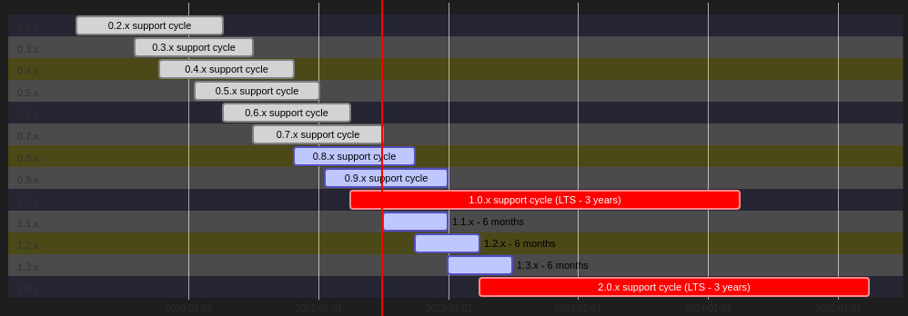

# Release policy

Epiphany Platform uses [semantic versioning](https://semver.org/).  
Example:  
Major release - 0.x.x  
Minor release - 0.2.x  
Patch release - 0.2.1  
Pre-release - 0.3.0rc1

Currently, we supporting quarterly minor releases. These minor releases also include patch releases.

# Epiphany Platform lifecycle

## Short-term Support (STS)

Versions will be released every quarter (except the quarter when the LTS version is published), and each STS version will be supported for up to 6 months.

## Long-term Support (LTS)

The LTS version will be released once a year and will be supported for up to 3 years. During support time, patch releases will be made to the LTS version. The patch version will be released immediately after critical bug fix, in case of minor issues the patch version will be released along with other releases (quarterly).

| Epiphany version | Release date | Latest version | Release date | End of support |
| ----------------------| --------------- | -------------|--------------------|--------------- |
| 0.2.x | 19 Feb 2019 | 0.2.3 | 11 May 2019 | 6 Apr 2020 |
| 0.3.x | 2 Aug 2019 | 0.3.2 | 21 May 2019 | 1 Jul 2020 |
| 0.4.x | 11 Oct 2019 | 0.4.5 | 2 Oct 2020 | 22 Oct 2020 |
| 0.5.x | 17 Jan 2020 | 0.5.6 | 4 Nov 2020 | 19 Jan 2021 |
| 0.6.x | 6 Apr 2020 | 0.6.2 | 9 Apr 2021 |  01 Apr 2021 |
| 0.7.x | 1 Jul 2020 | 0.7.3 | 15 Apr 2021 | 30 Jun 2021 |
| 0.8.x | 22 Oct 2020 | 0.8.2 | 13 Apr 2021 | est. 30 Sep 2021 |
| 0.9.x | 19 Jan 2021 | 0.9.1 | 22 Apr 2021 | est. 30 Dec 2021 |
| 1.0.x LTS| 01 Apr 2021 | 0.10.0 | 01 Apr 2021 | 01 Apr 2024 |
| 1.1.x STS| est. 30 Jun 2021 | - | - | est. 30 Dec 2021 |
| 1.2.x STS| est. 30 Sep 2021 | - | - | est. 30 Mar 2021 |
| 1.3.x STS| est. 30 Dec 2021 | - | - | est. 30 Jun 2022 |
| 2.0.x LTS| est. 01 Apr 2022 | - | - | est. 01 Apr 2025 |

source: [LIFECYCLE_GANTT.md](LIFECYCLE_GANTT.md)
