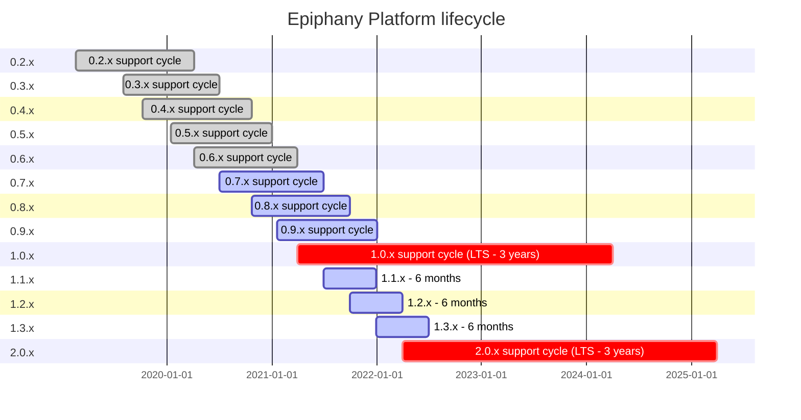

# Epiphany Platform lifecycle - Gantt chart

This is a source for the image used in [LIFECYCLE.md](LIFECYCLE.md) file.
Currently, Github doesn't support it natively (but feature request was made: [link](https://github.community/t/feature-request-support-mermaid-markdown-graph-diagrams-in-md-files/1922) ).

Extensions for browsers:
- [Chrome](https://chrome.google.com/webstore/detail/github-%2B-mermaid/goiiopgdnkogdbjmncgedmgpoajilohe)
- [Firefox](https://addons.mozilla.org/en-US/firefox/addon/github-mermaid)